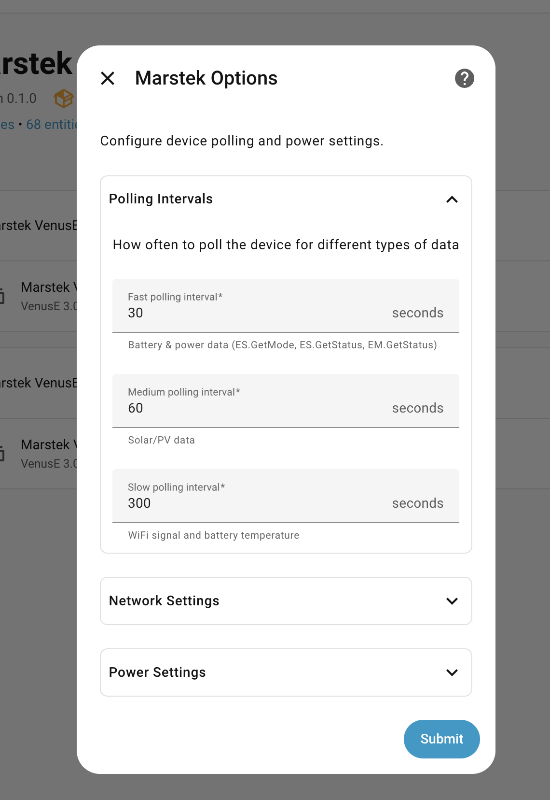
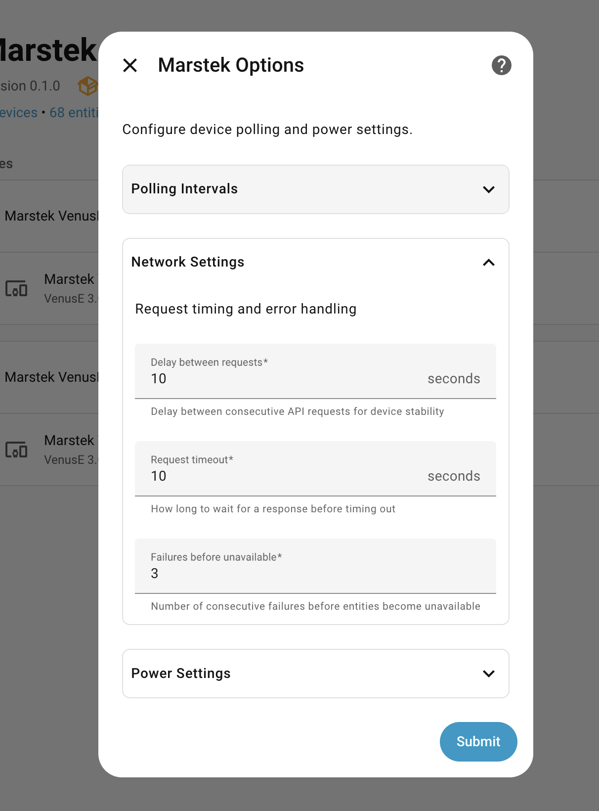
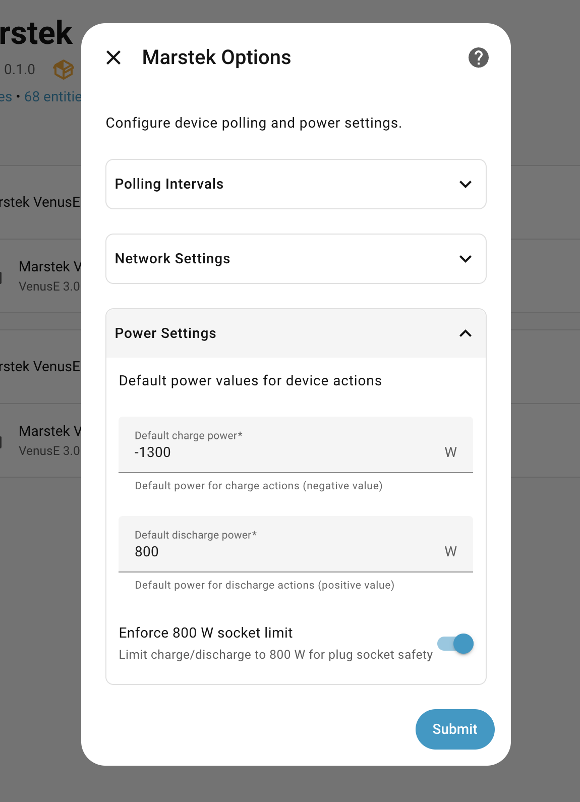

# Options

Open **Settings → Devices & services → Marstek → (device) → Configure**.

## Polling

The integration uses tiered polling to reduce device load:

- **Fast** (default 30s): mode/status/meter (real-time power)
- **Medium** (default 60s): PV status (Venus A/D)
- **Slow** (default 300s): WiFi + battery diagnostics

## Network & requests

Options also expose request timing knobs to avoid UDP bursts:

- Request delay (range 1–30s)
- Request timeout (range 5–60s)
- Failures before unavailable (range 1–10)

## Power / behavior

These settings affect automations and command validation:

- Action charge power (W): default power for the **Charge** device action
- Action discharge power (W): default power for the **Discharge** device action
- Socket limit: toggles an internal power-limit model used to validate requested power (applies to services and actions)

## Reconfigure

If you need to reconfigure the entry (e.g., after changes), use the device’s configure/reconfigure flow.

